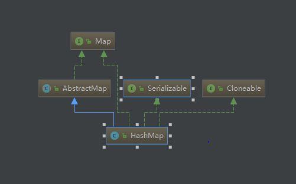

# LinkedList 源码分析

 -  
   &nbsp;&nbsp;&nbsp;&nbsp;&nbsp;&nbsp;&nbsp;&nbsp;&nbsp;&nbsp;&nbsp; &nbsp;&nbsp;&nbsp;&nbsp;&nbsp;&nbsp;&nbsp;&nbsp;&nbsp;&nbsp;&nbsp;&nbsp;&nbsp;&nbsp;&nbsp;&nbsp;&nbsp;&nbsp;&nbsp;&nbsp;&nbsp;&nbsp;&nbsp;&nbsp;&nbsp;&nbsp;&nbsp;&nbsp;&nbsp;&nbsp; &nbsp;&nbsp;&nbsp;&nbsp;&nbsp;&nbsp;&nbsp;&nbsp;&nbsp;&nbsp;&nbsp;&nbsp; &nbsp;&nbsp;&nbsp;&nbsp;&nbsp;&nbsp;&nbsp;&nbsp;&nbsp;&nbsp;&nbsp;&nbsp; &nbsp;&nbsp;&nbsp;&nbsp;&nbsp;&nbsp;&nbsp;&nbsp;&nbsp;&nbsp;HashMap 类图结构
    - 简单一句话概括LinkedList:底层结构为数组+链表(JDK8,链表长度为8则转为红黑树),这个类与HashTable近似等价，区别在于HashMap不是线程安全的并且允许null键和null值。由于基于哈希表实现，所以HashMap内部的元素是无序的。HashMap对与get与put操作的时间复杂度是常数级别的（在散列均匀的前提下）其提供键值对(可为null,此时key的hashcode为0)映射,但不保证顺序(包括在扩容时可能的改变),默认大小为16(总是为2的幂次方,目的是减少哈希冲突),负载因子0.75 (即实质上容量为0.75乘以16),扩容时为原始容量的两倍.如果需要满足线程安全，可以用 Collections的synchronizedMap方法使HashMap具有线程安全的能力，或者使用ConcurrentHashMap
    - HashMap的一些字段
        -  ```static final int DEFAULT_INITIAL_CAPACITY = 1 << 4; // aka 16，默认的初始容量```
       
        -  ```static final float DEFAULT_LOAD_FACTOR = 0.75f; //默认负载因子```
         
        -  ```threshold = DEFAULT_INITIAL_CAPACITY*float DEFAULT_LOAD_FACTOR:所容纳k-v的极限数，超过这个数目就重新resize(扩容)，扩容后的HashMap容量是之前容量的两倍```
    
        - ``` size:就是HashMap中实际存在的键值对数量```
    - HashMap的一些方法
    
        - HashMap 定位数组索引方法
        ```//Hash算法本质上就是三步：取key的hashCode值、高位运算、取模运算(&比%具有更高的效率)
             static final int hash(Object key) {
                  // h = key.hashCode() 为第一步 取hashCode值
                  // h ^ (h >>> 16)  为第二步 高位参与运算
                  int h;
                  return (key == null) ? 0 : (h = key.hashCode()) ^ (h >>> 16);
              }
              
              
          i = (length - 1) & hash//i:索引位置,length：数组的长度

       ```
        -  put(K key, V value)方法
        ``` public V put(K key, V value) {
                   return putVal(hash(key), key, value, false, true);
               }
               
              final V putVal(int hash, K key, V value, boolean onlyIfAbsent,
                             boolean evict) {
                  Node<K,V>[] tab; Node<K,V> p; int n, i;
                  if ((tab = table) == null || (n = tab.length) == 0)
                      n = (tab = resize()).length;//判断键值对数组table[i]是否为空或为null，否则执行resize()进行扩容；
                  if ((p = tab[i = (n - 1) & hash]) == null)//根据键值key计算hash值得到插入的数组索引i
                      tab[i] = newNode(hash, key, value, null);
                  else {
                      Node<K,V> e; K k;
                      //判断table[i]的首个元素是否和key一样
                      if (p.hash == hash &&
                          ((k = p.key) == key || (key != null && key.equals(k))))
                          e = p;
                       //判断table[i] 是否为treeNode，即table[i] 是否是红黑树，如果是红黑树，则直接在树中插入键值对
                      else if (p instanceof TreeNode)
                          e = ((TreeNode<K,V>)p).putTreeVal(this, tab, hash, key, value);
                      //遍历table[i]，判断链表长度是否大于8，大于8的话把链表转换为红黑树，在红黑树中执行插入操作.
                      else {
                          for (int binCount = 0; ; ++binCount) {
                              if ((e = p.next) == null) {
     
                                  p.next = newNode(hash, key, value, null);
                                  //链表长度大于8转换为红黑树进行处理
                                  if (binCount >= TREEIFY_THRESHOLD - 1) // -1 for 1st
                                      treeifyBin(tab, hash);
                                  break;
                              }
                              if (e.hash == hash &&
                                  ((k = e.key) == key || (key != null && key.equals(k))))
                                  break;
                              p = e;
                          }
                      }
                      if (e != null) { // existing mapping for key
                          V oldValue = e.value;
                          if (!onlyIfAbsent || oldValue == null)
                              e.value = value;
                          afterNodeAccess(e);
                          return oldValue;
                      }
                  }
                  ++modCount;
                   // 如果数组大小 超过 负载因子*实际容量 则扩容
                  if (++size > threshold)
                      resize();
                  afterNodeInsertion(evict);
                  return null;
              }     
      ```
    
       - get方法 
       
       ```  public V get(Object key) {
                  Node<K,V> e;
                  return (e = getNode(hash(key), key)) == null ? null : e.value;
              }
           final Node<K,V> getNode(int hash, Object key) {
              Node<K,V>[] tab; Node<K,V> first, e; int n; K k;
              if ((tab = table) != null && (n = tab.length) > 0 &&(first = tab[(n - 1) & hash]) != null) {//table不为null且索引处的首节点不为null
                  if (first.hash == hash && // always check first node
                      ((k = first.key) == key || (key != null && key.equals(k))))
                      return first;//  则检查首节点的哈希值以及key值是否相等,相等则直接返回该节点;
                  if ((e = first.next) != null) {
                      if (first instanceof TreeNode)// //如果首节点的next节点不为null则先检查 节点是否为树节点,是则通过getTreeNode方法获取节点
                          return ((TreeNode<K,V>)first).getTreeNode(hash, key);
                      do {
                          if (e.hash == hash &&
                              ((k = e.key) == key || (key != null && key.equals(k))))
                              return e;//否则遍历链表获取节点;
                      } while ((e = e.next) != null);
                  }
              }
              return null;
          }
         ```    
            
       - 扩容机制 
     ``` 
    /**
     * Initializes or doubles table size.  If null, allocates in
     * accord with initial capacity target held in field threshold.
     * Otherwise, because we are using power-of-two expansion, the
     * elements from each bin must either stay at same index, or move
     * with a power of two offset in the new table.
     *
     * @return the table
     */
    final Node<K,V>[] resize() {
        Node<K,V>[] oldTab = table;
        int oldCap = (oldTab == null) ? 0 : oldTab.length;
        int oldThr = threshold;
        int newCap, newThr = 0;
        if (oldCap > 0) {
            //超过最大值就不再扩充了.
            if (oldCap >= MAXIMUM_CAPACITY) {
                threshold = Integer.MAX_VALUE;
                return oldTab;
            }
            // 没超过最大值，就扩充为原来的2倍
            else if ((newCap = oldCap << 1) < MAXIMUM_CAPACITY &&
                     oldCap >= DEFAULT_INITIAL_CAPACITY)
                newThr = oldThr << 1; // double threshold
        }
        else if (oldThr > 0) // initial capacity was placed in threshold
            newCap = oldThr;
        else {               // zero initial threshold signifies using defaults
            newCap = DEFAULT_INITIAL_CAPACITY;
            newThr = (int)(DEFAULT_LOAD_FACTOR * DEFAULT_INITIAL_CAPACITY);
        }
        // 计算新的resize上限
        if (newThr == 0) {
            float ft = (float)newCap * loadFactor;
            newThr = (newCap < MAXIMUM_CAPACITY && ft < (float)MAXIMUM_CAPACITY ?
                      (int)ft : Integer.MAX_VALUE);
        }
        threshold = newThr;
        @SuppressWarnings({"rawtypes","unchecked"})
            Node<K,V>[] newTab = (Node<K,V>[])new Node[newCap];
        table = newTab;
         // 把每个bucket都移动到新的buckets中
        if (oldTab != null) {
            for (int j = 0; j < oldCap; ++j) {
                Node<K,V> e;
                if ((e = oldTab[j]) != null) {
                    oldTab[j] = null;
                    if (e.next == null)
                        newTab[e.hash & (newCap - 1)] = e;
                    else if (e instanceof TreeNode)
                        ((TreeNode<K,V>)e).split(this, newTab, j, oldCap);
                    else { // preserve order链表优化重hash的代码块
                        Node<K,V> loHead = null, loTail = null;
                        Node<K,V> hiHead = null, hiTail = null;
                        Node<K,V> next;
                        do {
                            next = e.next;
                               // 原索引
                            if ((e.hash & oldCap) == 0) {
                                if (loTail == null)
                                    loHead = e;
                                else
                                    loTail.next = e;
                                loTail = e;
                            }
                              // 原索引+oldCap
                            else {
                                if (hiTail == null)
                                    hiHead = e;
                                else
                                    hiTail.next = e;
                                hiTail = e;
                            }
                        } while ((e = next) != null);
                        // 原索引放到bucket里
                        if (loTail != null) {
                            loTail.next = null;
                            newTab[j] = loHead;
                        }
                        // 原索引+oldCap放到bucket里
                        if (hiTail != null) {
                            hiTail.next = null;
                            newTab[j + oldCap] = hiHead;
                        }
                    }
                }
            }
        }
        return newTab;
    }
    ```