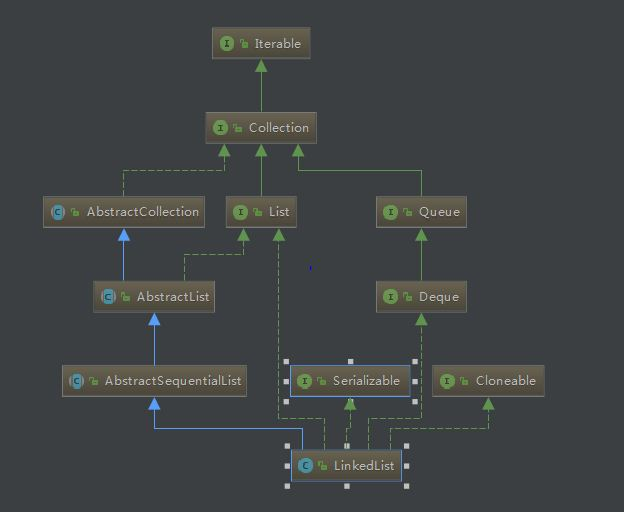

# LinkedList 源码分析

 - 
   &nbsp;&nbsp;&nbsp;&nbsp;&nbsp;&nbsp;&nbsp;&nbsp;&nbsp;&nbsp;&nbsp;&nbsp;&nbsp;&nbsp;&nbsp;&nbsp;&nbsp;&nbsp;&nbsp;&nbsp;&nbsp;&nbsp;&nbsp;&nbsp;&nbsp;&nbsp;&nbsp;&nbsp;&nbsp;&nbsp; &nbsp;&nbsp;&nbsp;&nbsp;&nbsp;&nbsp;&nbsp;&nbsp;&nbsp;&nbsp;&nbsp;&nbsp; &nbsp;&nbsp;&nbsp;&nbsp;&nbsp;&nbsp;&nbsp;&nbsp;&nbsp;&nbsp;&nbsp;&nbsp; &nbsp;&nbsp;&nbsp;&nbsp;&nbsp;&nbsp;&nbsp;&nbsp;&nbsp;&nbsp;LinkedList 类图结构
    - 简单一句话概括LinkedList:底层结构为双向链表(同时也实现了队列接口),当我们需要一种支持高效删除&添加元素的数据结构时，可以考虑使用链表
    - LinkedList的一些字段
        -  ```transient int size = 0;```
       
        -  ```transient Node<E> first;：指向头结点```
        
        -  ```transient Node<E> last;：指向尾结点```

    - LinkedList的一些方法
    
        - Node<E>方法
        ```
        private static class Node<E> {
               E item;//item为本结点所存储的数据对象
               Node<E> next;//Node对象的next域指向它的下一个结点
               Node<E> prev;//prev域指向它的上一个结点
       
               Node(Node<E> prev, E element, Node<E> next) {
                   this.item = element;
                   this.next = next;
                   this.prev = prev;
               }
         
       ```
        - addFirst(E e)方法
        ```public void addFirst(E e) {
                   linkFirst(e);
               }
            private void linkFirst(E e) {
                   final Node<E> f = first;//首先把头结点引用存于变量f中
                   final Node<E> newNode = new Node<>(null, e, f);//这个新结点的数据为我们传入的参数e，prev指针为null，next指针为f
                   first = newNode;//然后把头结点指针指向新创建的结点newNode
                   if (f == null)//若为null，说明之前链表中没有结点，所以last也指向newNode
                        last = newNode;
                    else//若f不为null，则把f的prev指针设为newNode
                        f.prev = newNode;
                    size++;
                    modCount++;//modCount的作用与在ArrayList中的相同,否对其进行了结构性修改
                   }
               
      ```
    
       - getFirst()方法 
       
       ``` public E getFirst() {
                  final Node<E> f = first;
                  if (f == null)
                      throw new NoSuchElementException();
                  return f.item;
              } 
         ```    
            
       - add方法// 仅仅是移动指针罢了 与数组拷贝相比效率提升很多 
       ```
         public boolean add(E e) {
                linkLast(e);
                return true;
            }
          void linkLast(E e) {
                final Node<E> l = last;
                final Node<E> newNode = new Node<>(l, e, null);
                last = newNode;
                if (l == null)
                    first = newNode;
                else
                    l.next = newNode;
                size++;
                modCount++;
             }

              
       ```
       ```
       public void add(int index, E element) {
             checkPositionIndex(index);//首先调用checkPositionIndex方法检查给定index是否在合法范围内
              
             if (index == size)//若index等于size，这说明要在链表尾插入元素，直接调用linkLast方法，这个方法的实现与之前介绍的linkFirst类似
                 linkLast(element);
             else//若index小于size，则调用linkBefore方法
                 linkBefore(element, node(index));
         }
         //在index处的Node前插入一个新Node（node(index)会返回index处的Node）
         void linkBefore(E e, Node<E> succ) {
                 // assert succ != null;
                 final Node<E> pred = succ.prev;
                 final Node<E> newNode = new Node<>(pred, e, succ);
                 succ.prev = newNode;
                 if (pred == null)
                     first = newNode;
                 else
                     pred.next = newNode;
                 size++;
                 modCount++;
             }
         ```