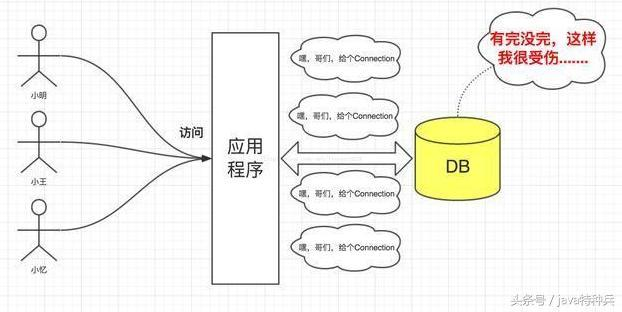
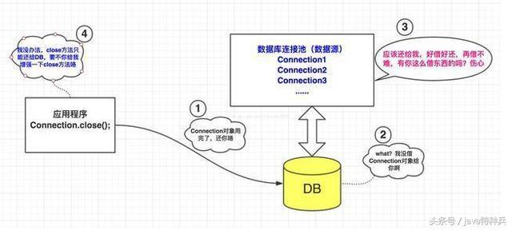

# java 基础
 - javac.exe&java.exe&javadoc.exe&PATH&CLASSPATH
   
     ||
     | :--------  |
     |javac.exe:将java源程序(*.java)编译成字节码文件(.class)<--虚拟机可识别|
     |java.exe：用来执行字节码文件，会启动jvm虚拟机加载运行时所需要的类库。|
     |javadoc.exe:生成java程序的注释文档|
     |CLASSPATH:它是javac编译器的一个环境变量，他的作用是：当你写入import java.util.*时，编译器面对import关键字，就知道你要引入java.util这个包下的类，但是你得告诉编译器你把包放在哪个位置了，如何告诉他呢，CLASSPATH就是这作用|
     |PATH环境变量: 作用是指定命令收索的路径，在命令中执行命令如：javac编译java,他会到PATH所指定的路径中查找是否能找到相对应的命令程序|
 - 基本类型
          
     |boolean|byte|char|short|int|float|long|double|
     | :--------   |  :--------  |  :--------  |  :--------  |   :--------  |  :--------  |  :--------  | :--------  | 
     |1bit|1B|2B|2B|4B|4B|8B|8B|
          
 - java 面向对象的三个特征和含义
   - 封装：属性和方法的封装。用不同的修饰符来加以控制。
   - 继承：子类可以继承父类的成员变量和成员方法。继承可以提高代码的复用性。
     - 继承的特性：1单一继承2子类继承父类的非私有成员变量和方法。3成员变量的影藏和方法的覆盖。
   - 多态：参考以下。
 - 什么是多态：
    -  多态的定义：不同类的对象对同一消息作出不同的响应（同一事件发生在不同的对象间产生不同的结果），
    根据发送对象的不同，采用多种不同的行为方式
    - 编译时多态：重载来实现
    -  动态绑定（运行时多态）：是指运行期间才知道对象的实际类型，根据实际类型调用其相对应的方法（重写）
    - 多态存在的三个必要条件
      -  要有继承 
      -  要有重写
      - 父类引用指向子类对象
- equals()&==&hashCode()&Object&hashMap
   - Object的方法有：
     - public final native Class<?> getClass();//返回描述调用对象的Class对象，当类被加载时，类Class的对象自动被创建，Class类的getName()方法获取类或者接口的全类名，通过newInstance()方法创建一个与调用对象内容相同的新实例，间接实现了对象的克隆。
     - public native int hashCode();//返回对象的哈希值
     -  public boolean equals(Object obj) {//指示其他某个对象是否与此对象的地址相等。
               return (this == obj);
            }
     -  protected native Object clone() throws CloneNotSupportedException;//创建并返回对象的一个副本,返回与调用对象内容相等的新对象。复制后，一个对象内容的改变的变化不会影响另一个对象。区别=
     -     public String toString() {//返回描述对象的一个字符串。
               return getClass().getName() + "@" + Integer.toHexString(hashCode());
           }
     - public final native void notify();//唤醒在此对象监视器上等待的单个线程
     -  public final native void notifyAll();//唤醒在此对象监视器上等待的所有线程
     -  public final native void wait(long timeout) throws InterruptedException;
     -  protected void finalize() throws Throwable { }//当垃圾回收器确定不存在对该对象的更多引用时，由对象的垃圾回收器调用此方法。
        - 从中我们可以知道java基类Object提供了不是final方法的equals()和hashCode(),都是可以被overWrite.
        - 如果不被重写(String...这些类equals()都被重写了)equals()方法是判断两个对象是否相等等同于==
        - hashCode()是一个native方法,返回是一个整型值，该native方法将对象在内存中的地址作为哈希码返回。保证不同对象的返回值不同。
  - 重写equals()方法应遵循的规则(详细内容可参照eEffective Java 一下我写出几个关键字)
    - 自反性
    - 对称性
    - 传递性
    - 一致性
    - 非null
  - hashCode()
    - 如果两个对象使用equals()方法判断相等，则hashCode()方法也应该相等。
    - 如果两个对象使用equals()方法判断不相等，则hashCode()方法不一定相等。
    - 在哈希表中，添加对象时，首先调用hashCode()方法计算对象的哈希码，通过哈希码可以直接定位对象在哈希表中的位置。如果该位置没有对象，可以直接将对象插入，如果该位置已经有对象存在了，则调用equals()方法比较它们是否相等，如果相等不保存其中，如果不等，则对象添加到链表中。
  - String 中equals()和hashCode()的实现
      ```   
       public int hashCode() {
             int h = hash;
             if (h == 0 && value.length > 0) {
                 char val[] = value;
     
                 for (int i = 0; i < value.length; i++) {
                     h = 31 * h + val[i];
                 }
                 hash = h;
             }
             return h;
         }


      ```
      ```  
       public boolean equals(Object anObject) {
                 if (this == anObject) {
                     return true;
                 }
                 if (anObject instanceof String) {
                     String anotherString = (String)anObject;
                     int n = value.length;
                     if (n == anotherString.value.length) {
                         char v1[] = value;
                         char v2[] = anotherString.value;
                         int i = 0;
                         while (n-- != 0) {
                             if (v1[i] != v2[i])
                                 return false;
                             i++;
                         }
                         return true;
                     }
                 }
                 return false;
             }

       ```
       - String 对象equals()相等的条件是二者为同为String对象，长度相等，字符串完全相同，不要求是同一个对象。
       - hashCode()方法栈有个质数31的作用:质数越大，哈希冲突越小，但是计算速度也越慢，31是折中的质数。
- String 和 StringBuffer的区别：
   
     -  简单地说，StringBuffer对象的内容是可以修改的；而String对象一旦产生就不可以被修改，重新赋值
     其实是两个对象。
     -  StringBuffer在进行字符串的处理时候，是不生成新的对象，在内存上要优于Stirng类，所以在实际的使用
     ，如果经常需要对一个字符串进行修改，使用、stringBuffer更加合适些。StringBuffer类是一种辅助类，
     可以预先分配指定长度的内存块建立一个字符串缓冲区。这样使用StingBuffer类的append方法追加字符，比String
     使用+操作符，每一次添加到一个字符串时，字符串对象都需要重新找一个新的内存空间来容纳更大的字符串，这是
     一个非常消耗时间的操作，添加一个字符就意味着要一次又一次的对字符串重新分配内存
     - StringBuffer 是内存安全的 
- Collection&Collections区别
  - Collection集合类的上级接口，继承该接口的接口主要有Set&List
  - Collections集合类的工具类，提供了一系类静态方法实现对各个集合类的收索、排序、线程安全化等操作。

- [hashSet如何保证不重复](../hashset如何保证不重复/test.java)
   - 前景：Set集合都是需要去掉重复元素的,如果在存储的时候逐个equals()比较,效率较低
   - 当HashSet调用add()方法存储对象的时候,先调用对象的hashCode()方法,然后在集合中查找是否有哈希值相同的对象
     如果没有哈希值相同的对象就直接存入集合.
- 什么是线程同步：
     -  当使用多个线程来访问同一个数据时候，容易引发出线程安全的问题（可能引发的数据的不一致问题）
     - _解决方法_：1 同步代码块：synchronized(对象){}
                 2 同步方法：public synchronized 数据的返回类型 方法名称（）{}
     - 同步方法的同步监视器为this 该对象自己本身（调用同步方法的对象） 
     - synchronized：可以修饰代码块，可以修饰方法，但是不可以修饰构造器和属性
     - 同步机制应该注意的点：
       - 1 安全性高，但是性能低，在多线程中使用。
       - 2 只需要对那些会改变共享资源的方法进行同步
       -  3 在单线程环境中，使用不安全的版本（没有同步的方法和代码块）以保证性能，在多线程中使用线程安全的版本
       
- 进程 和 线程：    

     - 进程的三个特点：
        -  独立性 进程是系统中独立存在的实体，他可以独立拥有资源，有独立的地址空间。用户进程不可以直接访问其他进程的地址空间。
        -   动态性 进程和程序的区别在于进程是动态的，进程中有时间的概念，进程具有自己的生命周期和各种不同的状态。
        - 并发性 多个进程可以在单个处理器上并发执行，互不影响。
    - 线程：
           简述： 线程是进程的组成部分，一个进程可以有多个线程。而一个线程必须拥有一个父进程。线程可以有自己的堆栈，自己的程序计数器和自己的局部变量，
           但是，不能拥有系统的资源。他和父进程的其他线程共享所有的资源。
     - 线程的特点：
        - 线程是独立运行的，其不知道进程中是否还有其他线程的存在
        -  线程的执行时抢占式的。
        - 线程是可以完成一定的任务，可以和其他线程共享父进程的共享变量和部分环境，相互协作来完成任务。
     
     - 进程的三种基本状态：
        - 就绪状态（Ready）
        - 执行状态（Running）
        -  阻塞状态（Blocked）
        
    -  三种情况引起的阻塞：
         - 等待阻塞：
                                  运行的线程执行wait()方法，该线程会释放占有的所有资源，jvm会把该线程放入“等待池”中。进入这个状态后，是不能自动唤醒的，
                               必须依靠其他线程调用notify()或者notifyAll()方法，才能被唤醒。
          - 同步阻塞：
                                  运行的线程在获取对象的同步锁时，若该同步锁被其他的线程占有，则jvm会把线程放入“锁池中”。
          -  其他阻塞:
                                  运行的线程执行sleep()或者其他线程join()，或者发出I/O请求时，jvm会把该线程设置为阻塞的状态。当sleep()状态超时，join()等待
                               进程终止或者超时，或者I/O处理时间完毕，线程重新进入到就绪状态。
    - 同步机制：
        - 临界区(Critical Section):保证在某一个时刻只有一个线程能访问数据的简便方法。
        - 互斥量(Mutex):只有拥有互斥对象的线程才具有访问资源的权限。（为协调共同对一个共享资源的单独访问而设计的）
        - 信 号量(Semaphores):为控制一个具有有限数量的用户资源而设计的。
        - 事件(Event):事件对象也可以通关过通知操作的方式来保持线程的同步。并且可实现不同进程中的线程同步操作。
 - Lock 和 Synchronized 的区别： 
   - Lock 是一个接口， synchronized 是Java中的一个关键字
   -  synchronized 在发生异常时，会自动释放线程占有的锁，因此不会导致死锁现象的发生。而lock在发生异常的时候，如果没有主动通过unLock()去释放，则会造成死锁的现象，
    所以在使用它的时候，需要在finally块中释放锁。
    - Lock可以让等待锁的线程响应中断，而synchronized却不行（线程就这么一直等下去）。
    - 通过lock 可以知道有没有成功获得锁，而synchronized却不行。
    - 当资源的竞争很强烈的时候，此时lock的性能要远远优于synchronized.
   
   
   
   
 -  [内存溢出&内存泄漏](c.md)
 
 
 - 重载和重写的区别：
   - 重载： 发生在同一类中，方法名必须相同，参数类型不同，个数不同，顺序不同，方法的返回值和访问修饰符可以不同
    - 重写： 在子类中定义一个功能不同的方法，但是方法的接口（名字&返回类型&参数列表&异常表）与父类的某一方法完全相同
       - 返回类型和父类的完全相同
       - 访问的修饰符必须比父类更加公开（private不能被重载）
       - 只能抛出那些父类声明的异常，允许少抛或者不抛出异常，但是禁止抛出父类接口不兼容的异常。
 - 构造器Constructor是否能被override：  
    -  答：不能
         构造器不能被重写，不能被用为static,只能是public protected private 三种权限的修饰符，且不能有返回值。
        
         
         
 - public protected private 
 
     -   public 在任何地方都能被访问
     - protected 在同包内的类以及包外的子类才能被访问
     - default 同包或者同类
      -  private 只有在本类中才能被访问
       
       
  - 自动住装箱和拆箱
     - 1装箱：将基本类型用他们对应的引用类型包装起来。
      -  2拆箱: 将包装类型转换成基本的数据类型。
      -  java 编译器会在编译期根据语法决定是否进行拆箱和装箱动作。
       
       
  - Error和Exception 的区别 
       -  1 Error 和 Exception类都是throwable 类的子类
       -  2 区别：
               1 Error 类一般指与虚拟机相关的问题，如系统奔溃，虚拟机错误，内存空间不足，方法调用栈溢出。对于这类错误的导致的
            应用程序中断，仅靠程序本身无法恢复和防御，遇见这样的问题，建议让程序终止。
               2 Exception 类表示程序可以处理异常，可以捕获而且可能恢复。遇见这类异常，应该尽可能处理异常，使程序恢复正常运行。
       - 3 引申
         -  unchecked :
                         1 指的是程序的瑕疵或者逻辑错误，并且在运行时无法恢复。
                         2 包括Error 或者 RuntimeException 及其子类 如：OutOfMemoryError NullPointerException IndexOutOfBoundException等
                         3 语法上不需要申明抛出异常
                   
         -   checked : 
                         1 代表程序不能直接控制的无效外界情况（数据库问题，网络异常等）
                         2 ClassNotFoudException SQLException
                         3 需要try catch 处理或者throws申明抛出的异常
  - java中如何实现代理机制  
      - 1 jdk动态代理：代理类和目标类实现了共同的接口->InvocationHandler
      -  2 CGLIB动态代理：代理类是目标类的子类，用到MethodInterceptor
 - 死锁的产生和预防
      -  产生死锁的四个必要条件：
         - 互斥条件：所谓的互斥就是在某一时间独占资源
         -  请求与保持条件：一个进程因请求资源而阻塞时，对以获得的资源不放
         - 不可剥夺条件：进程以获得资源，在未使用完之前，不能强行剥夺。
         -  循环等待条件：若干线程之间形成了一种头尾相接的循环等待资源关系。
     -  死锁的预防：
        -  打破互斥条件：允许进程同时访问某些资源。但是有些资源却不能被同时访问的，如打印机。
        -  打破不可抢占的条件：即进程可以强行从占有者那里剥夺某些资源。:当一个进程已经占有某些资源，他又申请资源，但是不能及时被满足，那么
                  它将释放所占有的资源，以后再重新申请。它释放的资源可重新分配给其他的线程。这种死锁的方法实现起来困难，会降低系统的性能。
         -  打破占有且申请条件。可以实现资源预先分配策略，即进程在运行前一次性地向系统申请所有需要的全部资源。如果某个线程的全部资源得不到满足
                  ，则不给分配资源，此进程暂不运行。
         -   打破循环等待的条件：实行资源的有序分配策略，采用这种策略，即把资源事先分类编号，按号分配，使进程在申请，占有资源不会形成环路，进程的
                  占有了小号资源，才能申请大号资源，就不会产生环路，从而预防了死锁。
 -  序列化 和 反序列化  
     - 这些I/O流只能以字符或字节进行数据的读写，可以处理字符串或基本数据类型，但是却无法处理对象类型。可否以对象为单位进行数据的存储和传输呢?
         - 通过对象序列化实现,注：被transient,static修饰的属性不能被序列化.

     - 序列化: 把对象转化为字节序列的过程。
    - 反序列化： 把字节序列恢复为对象的过程。
    - 对象序列化的用途：
        -  把对象的字节序列永久地保存在硬盘上，通常保存在一个文件中。
         - 在网络上传送对象的字节序列
                                  当两个进程在进行远程通信的时候，彼此可以发送各种类型的数据，都会以二进制序列的形式在网络上传送，发送方需要把java对象转化为字节序列，
                              接收方则需要把字节序列转化为java对象。
    - 方法实现步奏：
      - 序列化实现步奏
      
           | 序列化实现步骤 |反序列化步骤|
           | :--------  | :----------|
           | 1：导入java.io包 | 1：导入java.io包  |
           | 2: 需要序列化的对象所属的类必须实现Serializable接口| 2：需要|反序列化的对象所属的类必须实现Serializable接口|
           | 3：构造FileOutputStream对象| 3:构造FileInputStream对象|
           | 4：构造ObjectOutputStream对象| 4：构造ObjectInputStream对象|
           | 5：使用ObjectOutputStream对象的writeObject()方法进行序列化| 5：使用ObjectInputSteam对象的readObject()方法进行反序列化|
           | 6：关闭ObjectOutputStream对象| 6：关闭ObjectInputStream对象|
           | 7：关闭FileOutputStream对象| 7：关闭FileInputSteam对象|
           | 8：对序列化全过程捕获IOException异常| 8：对反序列化的全过程捕获ClassNotFoundException&IOException异常|
      - 继承一个Serializable接口
      ```
        package 序列化和反序列化;
         
         import java.io.*;
         /*
         * */
         
         class Student implements Serializable {
             private  String name;
             private int sex;
         
             public Student() {
             }
         
             public Student(String name, int sex) {
                 this.name = name;
                 this.sex = sex;
             }
         
             public String getName() {
                 return name;
             }
         
             public void setName(String name) {
                 this.name = name;
             }
         
             public int getSex() {
                 return sex;
             }
         
             public void setSex(int sex) {
                 this.sex = sex;
             }
         
         }
         public class transientDemo {
             public static void main(String[] args) throws IOException, ClassNotFoundException {
                 Student student = new Student("王博越", 1);
                 File file = new File("student.txt");
                 /*对象的序列化:将对象转化为字节序列
                 * */
                 FileOutputStream fos = new FileOutputStream(file);
                 ObjectOutputStream oos = new ObjectOutputStream(fos);
                 oos.writeObject(student);
                 oos.flush();
                 oos.close();
                 fos.close();
                  /*对象的反序列化：将字节序列转化成对象
                 * */
                 FileInputStream fis = new FileInputStream(file);
                 ObjectInputStream ois = new ObjectInputStream(fis);
                 Student student1 = (Student) ois.readObject();
                 System.out.println(student1.getName() + " : " + student1.getSex());
                 ois.close();
                 fis.close();
         
             }
          
         }
       ```
      - transient关键字来修饰不想被序列化的字段//name输出为null;
      ```package 序列化和反序列化;
         
         import java.io.*;
         /*
         * */
         
         class Student implements Serializable {
             private transient String name;
             private int sex;
         
             public Student() {
             }
         
             public Student(String name, int sex) {
                 this.name = name;
                 this.sex = sex;
             }
         
             public String getName() {
                 return name;
             }
         
             public void setName(String name) {
                 this.name = name;
             }
         
             public int getSex() {
                 return sex;
             }
         
             public void setSex(int sex) {
                 this.sex = sex;
             }
         
         }
         public class transientDemo {
             public static void main(String[] args) throws IOException, ClassNotFoundException {
                 Student student = new Student("王博越", 1);
                 File file = new File("student.txt");
                 /*对象的序列化:将对象转化为字节序列
                 * */
                 FileOutputStream fos = new FileOutputStream(file);
                 ObjectOutputStream oos = new ObjectOutputStream(fos);
                 oos.writeObject(student);
                 oos.flush();
                 oos.close();
                 fos.close();
                  /*对象的反序列化：将字节序列转化成对象
                 * */
                 FileInputStream fis = new FileInputStream(file);
                 ObjectInputStream ois = new ObjectInputStream(fis);
                 Student student1 = (Student) ois.readObject();
                 System.out.println(student1.getName() + " : " + student1.getSex());
                 ois.close();
                 fis.close();
         
             }
         }

       ```
      - 使用Externalizable:此接口会有重大的安全隐患，因为以下两个方法声明为public，因此恶意类可以用这些方法读取和写入对象数据，如果反序列化对象包含了敏感的信息，则要格外小心。
       ```
        -  void writeExternal(ObjectOutput out) throws IOException;
           void readExternal(ObjectInput in) throws IOException, ClassNotFoundException; 控制对象的序列化和反序列化。
        ```
 -  json 和 xml    
    - xml : 
       - 应用广泛，可扩性强，被广泛地应用在各种场合。
       -  读取解析没有 json 快。
         -  可读性强，可描述复杂的结构。
    - json :
       - 结构简单，都是一些键值对。
       -  读取解析的速度比较快，很多语言支持。
        -  传输量比较小，传输速率大大提高
        - 描述复杂的结构的能力比较弱。
                
 - 接口和抽象类的区别：
   - 1语法层面的区别：
      - 抽象类可以提供成员方法的实现细节（可以包含非抽象的方法），而接口中只能存在public abstract方法（但java8中的接口可以有default方法）
      - 抽象类中的成员变量可以是各种类型的，而接口中的成员变量只能是public static final类型
      - 一个类只能继承一个抽象类，而一个类却可以实现多个接口。
   - 2设计层面上的区别：
      - 抽象层次的不同：抽象类是对类的整体抽象，包括属性和行为的抽象，而接口只是对行为的抽象。
      - 跨域的不同：抽象类所体现的是一种继承的关系，父类和派生类之间必须存在is-a 关系（猫狗抽象出动物类），而接口是has-a的关系，实现他的子类可以不存在任何关系（鸟和飞机，实现fly接口）
      - 设计层次不同：抽象类是自底而上设计，接口是自顶向下。
 
 - 反射机制[java反射机制](../java反射机制/Test1.java)
      - 在java中只要给定了类的名字，就可以通过反射机制来获取类的所有信息。
      - 4中方法来获取Class对象
        - Class.forName("类的路径");
        - 类名.class
        - 对象名.getClass();
        - 如果是基本类型的包装类，可以通过调用包装类的Type属性来获取包装类的Class对象。(Class<?>clazz=Integer.TYPE)
      - 实现java的反射类
        - Class:它代表正在运行的java应用程序中的类和接口
        - Field:提供了有关类或接口的属性信息，以及对他的动态访问权限。
        - Constructor:提供关于类的单个构造方法的信息以及对他的动态访问权限。
        - Method:提供了类或者接口中的某个方法的信息。
        
 - 泛型类
    - 在创建一个类的时候，类的部分成员或者方法中的参数的类型可以暂时不指定特定的类型，而是用一个符号代替，所以泛型也被称为参数化类型和参量多态。
 
 - 数据库连接池
   - 什么是数据库连接池：在应用程序刚启动时，先和数据库拿到一批Connection对象，比如20个，保存在这个容器（池）中，于是这个容器（池）就称为“数据库连接池”
   - 为什么要使用数据库连接池(数据源):当用户需要对数据表进行操作时，就需要先连接到对应的数据库，拿到一个Connection对象然后进行其他操作，试想一下，要是一个应用一天有1万个用户进行访问，这样的连接操作就要进行一万次。而数据库连接是非常消耗资源的，也是非常宝贵的，这样会大大减低性能，什么是性能？可以理解为每次拿这个连接的时候，数据库的压力都很大，消耗的时间都很长等等             
      
   - 为什么要引入c3p0&dbcp等数据库连接框架：但是咱们注意，当我们调用Connection对象的close方法时，这个连接到底还给了“数据库连接池”还是“还给了数据库”，显然是还给了“数据库”，这样肯定不行。要对close方法进行改造，不能用原来jdbc中的close方法，那怎么改造呢？方式有很多，可以使用子类继承父类（Connection类）然后复写其中的close方法，但是这种做法比较麻烦，而且还要重写父类中的所有方法，不太合理。还可以使用包装设计模式和动态代理。不过对于初学者写起来也是一件比较费劲的事情。另外还有很多细节需要考虑，比如数据库连接池的初始化大小，最大连接数，最长等待时间等等，这时候大家会想，原来写一个自己的数据库连接池（数据源）也不容易啊，最好是能有人帮我们写好了，然后咱们直接用就好了，因为数据库连接池的这种思想的确是好，可以大大提升我们访问数据库的性能。既然数据库连接池这么有必要，那肯定有人帮我们已经做好了这些事情，这里就要提到市面上很多数据库连接池框架，比如dbcp，c3p0等
                                                                                                                                                                                                                                            
                                                                                                                                                                                                                                       
     
- 线程池
   - 为了避免系统频繁创建和销毁线程，我们可以将创建的闲成狗复用。
   
      | Executor框架提供了各种类型的线程池|
      | :--------  | 
      |newFixedThreadPool :该方法返回的是一个固定线程数量的线程池，该线程池中的线程数量始终不会变，当新的任务被提交时，若线程池中没有空闲的线程，则该任务会被暂存一个任务队列中|
      |newSingleThreadExecutor:该方法返回只有一个线程的线程池|
      |newCachedThreadPool :该方法返回的是一个根据实际情况调整线程数量的线程池|
      |newScheduledThreadPool :该方法返回一个scheduledExecutorService对象，线程池可以指定线程数量|
      |newSingleScheduledThreadPool|
     