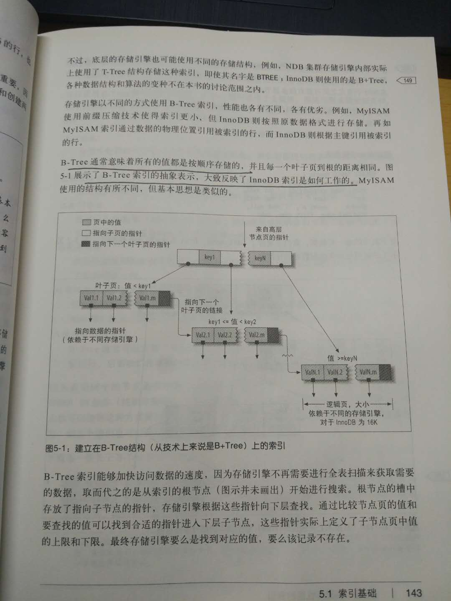

# 数据库 
  - MySql的逻辑架构  
    参考链接： https://www.jianshu.com/p/e29a433db2ec
  - CRUD
  
     |数据库的增删改查|
     | :-----   | 
     | select fields from table;|
     |insert into table() values();|
     | update from table set fields=xxx where id=xx;|
     |delete table where id=xx;|
  - 三大范式
    - 1NF 是指数据库表中的每一列都是不可分割的基本数据项，例如地址字段就具有值域可分。
    - 2NF 非主属性(不属于候选码中的字段)不能部分依赖主关键字(主键的关键字组成,主关键字是可选的)，实体的属性完全依赖于主键，所谓的完全依赖是指不能存在于仅依赖主键一部分的属性。如果存在，那么这个属性和主关键字的这一部分应该分离出来，形成一个新的实体。新实体与原有的实体之间是一对多的关系。为实现区分通常需要为表中添加一个列，以存储各个实例的唯一标识。
    - 3NF 不允许存在传递依赖,非主属性都应该直接依赖候选码,例如有r(R)=(A,B,C),F={A->B,B->C},A为候选码,若要符合3NF,则需要进行表分解,即r1(R)=(A,B),r2(R)=(B,C);
  - mysql 数据库的表锁、行锁、页级锁
    - 表锁：直接锁定整张表，在锁定的期间，其他进程无法对该表进行写操作，如果是写锁，则其他进程读也不允许。
    - 行锁：仅对指定的记录进行加锁，这样其他进程还是可以对同一表中的其他记录进行操作。
    - 页级锁：表级锁的速度快，但是冲突多，行级锁冲突少，但是速度慢，所以采取了折中的页级锁，一次锁定相邻的一组记录。
  - ACID
    - 原子性(atomicity): 一个事物必须被视为一个不可分割的最小工作单元，整个事物中的操作要么全部提交成功，要么全部失败回滚，对于一个事物来说，不可能只执行其中的一部分操作，这就是的原子性。
    -  一致性(consistency): 数据库总是从一个一致性的状态转到另一个事务的一致性状态。
        
        |由于事物的一致性，所以如果这时候执行完第三系统突然奔溃，支票账户也不会损失100，因为事物还没提交|
         | :-----   | 
         |1 start transaction  ;|
         | 2 select * from checking where id=1;|
         | 3 update checking set balance=balance-100 where id=1;|
         |  4 update savings set balance=balance+100 where id=1;|
         |  5 commit;|
      
     - 隔离性(isolation):一个事物所做的修改在最终提交前，对其他事物是不可见的。在前面的例子中，如果执行到第3，此时有另一个账户汇款，则其看见的支票账户得余额并没有被减去100。
     
     - 持久性(durability): 一旦事物提交，则其所做的修改就会永远保存在数据库中。
  - 事物的隔离级
    - read uncommitted(未提交读)：事物中的修改，即使没有提交，对其他事物也是可见的。事物可以读取未提交的数据(在实际的开发中一般很少使用)
    - read committed(提交读)：一个事物的开始直到提交之前，所做的任何修改对其他事物都是不可见的。这个级别也叫做不可重复读，因为两次的执行同样的查询，可能会得到不一样的结果。
    - repeatable read(可重复读)：该级别保证了同一个事物中，多次读取同样记录的结果是一致的。但理论上还是没有解决幻读。
    - serializable可串行化：是最高的隔离级别，它通过强制事物串行执行，serializable会在每一行的数据加锁，所以可能导致大量的超时和锁争用的问题。(实际开发少用)
   - ANSI SQL隔离级别
   
     |  隔离级别       | 脏读可能性    |  不可重复读  | 幻读可能性    |  加锁读  |
     | :--------  | :-----   | :---- | :-----   | :---- |
     |  读未提交        | Yes      |   Yes    |Yes|No|
     |  读已提交        | No      |   Yes    |Yes|No|
      |  可重复读       | No      |   No   |Yes|No|
      | 可串行化|No|No|No|Yes|
       - 脏读：读取了未提交的数据
       - 不可重复读：前后读取数据不一致
       - 幻读：指的是在某个事物在读取某个范围记录时，另一个事务又在该范围内插入了新的记录，当之前的事物再次读取该范围的记录时，会产生幻行。
       InnoDB和XtraDB存储引擎通过多版本并发控制(MVCC)解决了幻读的问题。
       
         |这时候T1在插入的时候就会出现错误，因为记录已经存在|
          | :-----   | 
          |T1 select * from user where id=1;|
          |T2  insert into user('id','username')values(1,'wby');|
          |T1 insert into user('id','username')values(1,'wby');|
                                                                 
                                                                  
 - 乐观锁&悲观锁
   - 乐观锁：对更新的数据提交才校验是否冲突(数据版本：第一种是使用版本号，第二种是使用时间戳)
     - 数据版本,为数据增加的一个版本标识。当读取数据时，将版本标识的值一同读出，数据每更新一次，同时对版本标识进行更新。当我们提交更新的时候，判断数据库表对应记录的当前版本信息与第一次取出来的版本标识进行比对，如果数据库表当前版本号与第一次取出来的版本标识值相等，则予以更新，否则认为是过期数据
   - 悲观锁：在整个数据处理过程中，将数据处于锁定状态。
     -MySQL InnoDB中使用悲观锁
       - 要使用悲观锁，我们必须关闭MySQL数据库的自动提交属性，因为MySQL默认使用autocommit模式，也就是说，当你执行一个更新操作后，MySQL会立刻将结果进行提交。 set autocommit=0;
       
         | MySQL InnoDB中使用悲观锁|
         | :--------  |
         | 0. 开始事务  begin;/begin work;/start transaction; (三者选一就可以)|
         | 1. 查询出商品信息 select status from t_goods where id=1 for update;|
         | 2. 根据商品信息生成订单   insert into t_orders (id,goods_id) values (null,1);|
         | 3. 修改商品status为2  update t_goods set status=2;|
         | 4. 提交事务 commit;/commit work;|
         | 上面的查询语句中，我们使用了 select…for update 的方式，这样就通过开启排他锁的方式实现了悲观锁。此时在t_goods表中，id为1的 那条数据就被我们锁定了，其它的事务必须等本次事务提交之后才能执行。这样我们可以保证当前的数据不会被其它事务修改。   上面我们提到，使用 select…for update 会把数据给锁住，不过我们需要注意一些锁的级别，MySQL InnoDB默认行级锁。行级锁都是基于索引的，如果一条SQL语句用不到索引是不会使用行级锁的，会使用表级锁把整张表锁住，这点需要注意|
      
 -  Mysql的数据类型
 
     |几个简单的原则有助于做出更好地选择|
     | :--------  |
     |1 更小的通常最好&确保没有低估 |
     |2 简单就好|
     |3 尽量避免NULL|
     
     |Mysql的数据类型|
     | :--------  |
     |1 整数类型：tingint(8bit)&smallint(16bit)&mediumint(24bit)&int(32bit)&bigint(64bit)&int unsigned...->有无符号类型都是使用相同的存储空间，并具有相同的性能&insigned:表示不出现负值，这大致可以使正数的上限提高一倍|
     |2 实数类型:带有小数部分的数字/decimal:应该只对小数进行精确计算时才使用上Mysql5.0和更好的版本中将数字打包到保存在一个二进制字符串中（每4个字节存9个数字）eg:decimal(18,9):小数点(占一个字节)&小数点前用4个字节存储9个数字，小数点后也一样|
     |3 字符串类型：varchar&char|
     |4 blob&text|
     |5 枚举类型：enum:可以把一些不重复的字符串存储成一个预定义的集合|
     |6 日期和时间类型timestamp&datetime|
     |7 位数据类型：bit|
     
     |varchar|char|
     | :-------- | :--------  |
     |用于存储可变长的字符|定长的|
     |需要额外的1&2个字节记录字符串的长度|会自动删除所有末尾的空格|
     |字符串列的最大长度比平均长度大很多优秀考虑|对于非常短的列Y&N|
     |列的更新很少，所以碎片不是问题|对于长变的，因为char不容易产生碎片|
     |会把过长的varchar存储为blob||
     
     |timestamp|datetime|
     | :--------  | :--------  |
     |4B|8B|
     |1970-2038年|1001-9999年|
     |显示的值依赖于时区|不依赖于时区|
    
 - 范式&反范式(上面的知识点已经整理了三大范式)
     
      |范式|反范式|
      | :--------  | :--------  |
      |范式化的更新操作通常比反范式要快|可以很好的避免关联|
      |范式化的表通常更小，可以更好的放在内存里，所以操作会更快||
      |很少&没有数据重复，只需修改更好的数据||
      |通常需要关联，稍微复杂的一些查询语句在符合范式的schema上都可能至少需要一次关联以上，不仅价格昂贵也可能使得一些索引的此略无效||
 
 - 索引 https://baike.baidu.com/item/%E6%95%B0%E6%8D%AE%E5%BA%93%E7%B4%A2%E5%BC%95/8751686?fr=aladdin
     - 什么是索引：是对数据库表中的一列&几列的值进行排序的一种结构。
     - 索引的优点
     
        |索引的优点|
        | :--------  | 
        |1 大大减少了服务器需要扫描的数据量|
        |2 可以帮助服务器避免排序&临时表 |
        |3 索引可以将随机IO变为顺序IO|
         
     - 常见的索引类型：
       - B-Tree 索引:全值索引&匹配最左前缀&匹配列前缀&匹配范围值&精确匹配某一列并范围匹配到另外一列&只访问索引的查询
           
       - 哈希索引
       - 空间数据索引
       - 全文索引
       - 其他索引类别
     
     
     
    
 - CAP
  
 