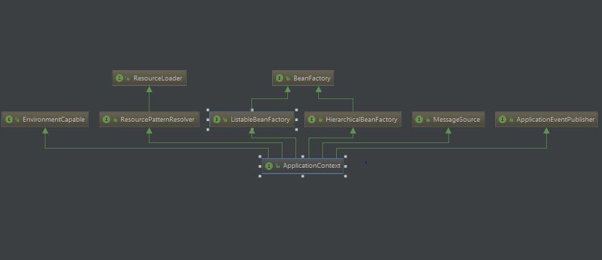
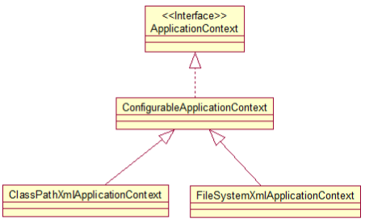

#j2ee解读
 - jsp&servlet
 - 表现层框架（Struts2&SpringMvc）
 - 持久化框架（Mybatis&Hibernate）
 - Spring
 
   - Spring 是一个容器, 因为它包含并且管理应用对象的生命周期.
     1. ApplicationContext ctx=new ClassPathXmlApplicationContext("applicationContext.xml");//创建spring的ioc容器(容器初始化bean)
     2. HelloWorld helloworld=(HelloWorld)ctx.getBean("applicationContext.xml所设置的id值");//容器中取出bean实例
     3. helloworld.methods()//调用方法
   - BeanFactory和ApplicationContext的区别
     1. BeanFactory是解析，管理，实例化所有容器的Bean的入口
 	 2. ApplicationContext继承自BeanFactory，提供了国际化，统一的资源文件读取方式等扩展
 	 3. BeanFactory在启动的时候不会实例化Bean，getBean()的时候才会实例化。ApplicationContext在解析配置文件时会对配置文件所有对象都初始化。
 	 4. ConfigurableApplicationContext 扩展于 ApplicationContext，新增加两个主要方法：refresh() 和 close()， 让 ApplicationContext 具有启动、刷新和关闭上下文的能力
     5. ApplicationContext 的主要实现类：
        - ClassPathXmlApplicationContext：从 类路径下加载配置文件
        - FileSystemXmlApplicationContext: 从文件系统中加载配置文件

        
   - IOC(Inversion of Control)：其思想是反转资源获取的方向. 传统的资源查找方式要求组件向容器发起请求查找资源. 作为回应, 容器适时的返回资源. 而应用了 IOC 之后, 则是容器主动地将资源推送给它所管理的组件, 组件所要做的仅是选择一种合适的方式来接受资源. 
      DI(Dependency Injection) — IOC 的另一种表述方式：即组件以一些预先定义好的方式(例如: setter 方法)接受来自如容器的资源注入. 
   - 自动装配
      1. no – 缺省情况下，自动配置是通过“ref”属性手动设定
      2. byName – 根据属性名称自动装配。如果一个bean的名称和其他bean属性的名称是一样的，将会自装配它。
        ```
         <bean id="address" class="com.hebeu.model.Address">     
           <property name="fulladdress" value="YiLong Road, CA 188"></property>  
         </bean> 
         //fulladdress是Address类的属性
        ```
      3. byType – 按数据类型自动装配。如果一个bean的数据类型是用其它bean属性的数据类型，兼容并自动装配它。  
      4. constructor – 寻找有相同构造参数的Bean进行装配
      5. autodetect – 先尝试以constructor的方法进行装配，失败后byType进行装配【在Spring3.0以后的版本被废弃，已经不再合法了】
   - Bean的作用域
     
