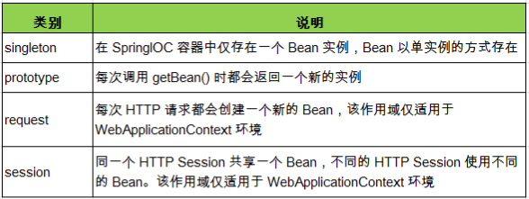
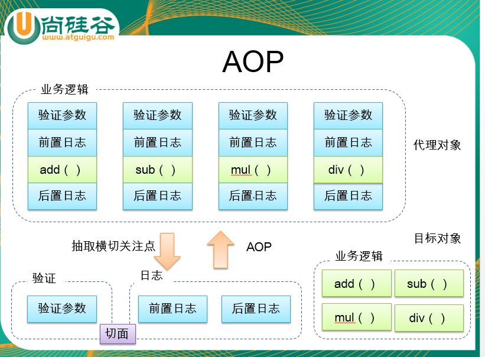
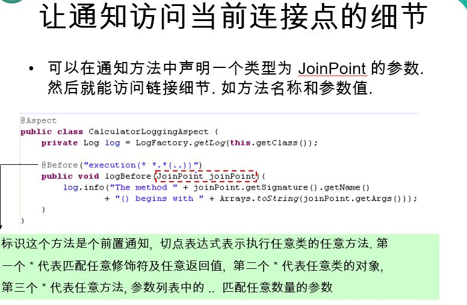

#j2ee解读
 - jsp&servlet
  -jsp
    - 什么是jsp:是一种动态的网页技术，jsp就是指在html中嵌套了java的脚本语言。
    - 工作原理：在web服务器接收到了jsp请求时，首先会对jsp文件进行翻译，将编写好的jsp文件通过jsp引擎转化成可识别的java源代码，java源代码再被编译成可执行的字节码文件（.class）,编译后进入执行阶段，将结果页面返回给客户端。
    - jsp九大内置对象
    
      |内置对象|描述|
      | :--------  | :--------  |
      |pageContext|jsp的页面容器|
      |request|得到用户的请求信息|
      |response|服务器向客户端返回的信息|
      |session|用来保存一个用户的信息|
      |application|表示所有用户的共享信息|
      |config|服务器配置，获取初始化参数|
      |out|页面输出|
      |page|表示从页面中表示出来的一个Servlet实例|
      |exception|表示jsp页面所发生的异常，在错误页面中才起作用|
      
      
  - servlet
    - 什么是servlet:Server+Applet(web环境下，运行于客户端的java组件),-->运行于服务端的java程序。servlet是特殊的java类并提供基于请求-响应模式的web服务，他没有main()方法，他不能独立运行，他是运行于容器中的。
    - 处理流程：浏览器中输入一串url地址，servlet容器通过url地址，通过web.xml配置文件找到对应的servlet,同时将请求转给servlet对应的service方法，（每当一个客户端请求一个HttpServlet对象的时候，该对象的service方法就会被调用，而且传递给这个方法一个HttpServletRequest对象&HttpServletResponse对象作为参数）,当时get请求的时候，service将请求转给doGet(),方法处理，当post请求的时候，则转给doPost()，方法处理。最后都是通过HttpServletResponse将响应结果返回给客户端。
   
      | servlet的生命周期 |
      | :--------  | 
      | 1： 构造器：只有第一次请求servlet时，创建servlet的实例，调用构造器，这说明servlet是一个单实例  | 
      | 2： init方法：只被调用一次，在创建好实例后立即被调用，用于初始化servlet（包含参数，初始化是构造器所不及的）|
      | 3： service方法：每一次的请求都会被调用，实际用于响应请求 |
      | 4： destroy方法：只被调用一次，在servlet所在的Web应用被卸载前被调用，用于释放当前servlet所占的资源 |
 
    - public void init(ServletConfig servletConfig)
       ```
         servletConfig 1封装了servlet的配置信息
                       2可获取servletContext对象 getServletContext()
            1.getInitParameter(String name):获取初始化参数
            2.getInitParameterNames():获取参数名组成的Enumeration对象
            3.getServletName()：获取<Servlet-name>文本内容
            
       ```
       
 - 表现层框架（Struts2&SpringMvc）
 - 持久化框架（Mybatis&Hibernate）
 - Spring
 
    
   - | Spring 是一个容器, 因为它包含并且管理应用对象的生命周期. |
     | :--------  | 
     | 1. ApplicationContext ctx=new ClassPathXmlApplicationContext("applicationContext.xml");创建spring的ioc容器(容器初始化bean) |
     | 2. HelloWorld helloworld=(HelloWorld)ctx.getBean("applicationContext.xml所设置的id值");容器中取出bean实例 |
     | 3. helloworld.methods()//调用方法 |


   - |BeanFactory和ApplicationContext的区别|
     | :--------  |  
     | 1. BeanFactory是解析，管理，实例化所有容器的Bean的入口|
 	 | 2. ApplicationContext继承自BeanFactory，提供了国际化，统一的资源文件读取方式等扩展|
 	 | 3. BeanFactory在启动的时候不会实例化Bean，getBean()的时候才会实例化。ApplicationContext在解析配置文件时会对配置文件所有对象都初始化。|
 	 | 4. ConfigurableApplicationContext 扩展于 ApplicationContext，新增加两个主要方法：refresh() 和 close()， 让 ApplicationContext 具有启动、刷新和关闭上下文的能力|
     | 5. ApplicationContext 的主要实现类：- ClassPathXmlApplicationContext：从 类路径下加载配置文件- FileSystemXmlApplicationContext: 从文件系统中加载配置文件|

        
   - IOC(Inversion of Control)：其思想是反转资源获取的方向. 传统的资源查找方式要求组件向容器发起请求查找资源. 作为回应, 容器适时的返回资源. 而应用了 IOC 之后, 则是容器主动地将资源推送给它所管理的组件, 组件所要做的仅是选择一种合适的方式来接受资源. 
      DI(Dependency Injection) — IOC 的另一种表述方式：即组件以一些预先定义好的方式(例如: setter 方法)接受来自如容器的资源注入. 
   - 自动装配
      1. no – 缺省情况下，自动配置是通过“ref”属性手动设定
      2. byName – 根据属性名称自动装配。如果一个bean的名称和其他bean属性的名称是一样的，将会自装配它。
        ```
         <bean id="address" class="com.hebeu.model.Address">     
           <property name="fulladdress" value="YiLong Road, CA 188"></property>  
         </bean> 
         //fulladdress是Address类的属性
        ```
      3. byType – 按数据类型自动装配。如果一个bean的数据类型是用其它bean属性的数据类型，兼容并自动装配它。  
      4. constructor – 寻找有相同构造参数的Bean进行装配
      5. autodetect – 先尝试以constructor的方法进行装配，失败后byType进行装配【在Spring3.0以后的版本被废弃，已经不再合法了】
   - Bean的作用域
     
   - Spring Bean的生命周期
   
     - 没配置后置处理器前
   
       | Spring IOC 容器对 Bean 的生命周期进行管理的过程|
       | :--------  | 
       | 1. 通过构造器或工厂方法创建 Bean 实例|
       | 2. 为 Bean 的属性设置值和对其他 Bean 的引用|
       | 3. 调用 Bean 的初始化方法|
       | 4. Bean 可以使用了|
       | 5. 当容器关闭时, 调用 Bean 的销毁方法|
           
     
     - 配置后置处理器后
     
       |Spring IOC 容器对 Bean 的生命周期进行管理的过程|
       | :--------  | 
       | 1. 根据一定的策略实例化Bean并且注入|
       | 2. 如果这个Bean实现了BeanNameAware接口，setBeanName()|
       | 3. 如果这个Bean实现了BeanFactoryAware接口，setBeanFactory()|
       | 4.	如果这个Bean实现了BeanPostProcessor接口，postProcessBeforeInitialization()|
       | 5. 如果这个Bean配置了init-method或者实现了InitializingBean接口，就初始化Bean|
       | 6. 如果这个Bean实现了BeanPostProcessor接口，postProcessAfterInitialization()|
       | 7. 如果配置了destroy-method或者实现了DisposableBean接口，会销毁Bean|
       
              

   - |Spring AOP中的概念|
     | :--------  | 
     |目标(Target): 被通知的对象|
     |增强处理（Advice）：就是你想要的功能|
     |通知(Advice):  切面必须要完成的工作|
     |切入点（PointCut）：准备进行增强处理的连接点|
     |连接点（Joinpoint）：可以进行增强处理的地方,程序执行的某个特定位置：如类某个方法调用前、调用后、方法抛出异常后等。连接点由两个信息确定：方法表示的程序执行点；相对点表示的方位。例如 ArithmethicCalculator#add() 方法执行前的连接点，执行点为 ArithmethicCalculator#add()； 方位为该方法执行前的位置|
     |切点（pointcut）：每个类都拥有多个连接点：例如 ArithmethicCalculator 的所有方法实际上都是连接点，即连接点是程序类中客观存在的事务。AOP 通过切点定位到特定的连接点。类比：连接点相当于数据库中的记录，切点相当于查询条件。切点和连接点不是一对一的关系，一个切点匹配多个连接点，切点通过 org.springframework.aop.Pointcut 接口进行描述，它使用类和方法作为连接点的查询条件。|
     |切面（Aspect）：Advice+PointCut横切关注点(跨越应用程序多个模块的功能)被模块化的特殊对象|
     |引入（Introduction）：允许我们向现有的类添加新方法属性|
     |织入（Weaving）：把切面应用到目标对象来创建新的代理的过程|
     
         

    - 事物的传播性行为   
    
         
       
       
       
      
   -----------------------------------------------------
   
   ##### spring部分知识点引用尚硅谷的教程
