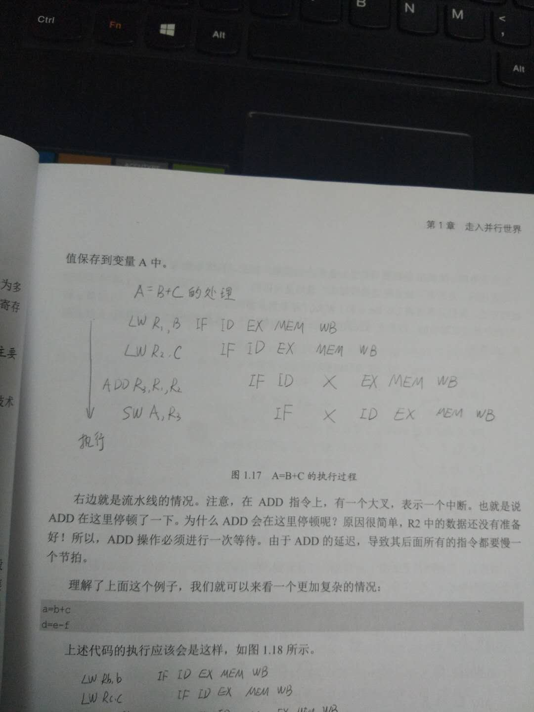

 #  高并发程序设计读后感
 
 - 并发的级别
 
   |||并发级别|||
   | :--------  | :--------  |  :--------  |   :--------  | :------|
   |1 阻塞(synchronized&重入锁)|2 无饥饿(无优先级)|3 无障碍，最弱的非阻塞调度(不会因为临界资源而挂起一方)&(一致性的标志，一旦检测到大家一起修改的共享数据，将对自己所做的修改进行回滚)|4 无锁(只要求一个线程可以在有限步内完成操作)|5 无等待(所有的线程都必须在有限步完成)|

- JMM(java的内存模型)<--保证多个线程间能够（数据安全性）&（数据的一致性）有效的、正确协同工作，JMM也就是为此而生的。
  
   ||||
   | :------ | :------| :------|
   |1 原子性：一个操作是不可中断的|2 可见性：当一个线程修改了共享变量，其他线程能否立即知道被修改 不能：（编译器&硬件优化的缘故）&（指令的重排序）|3 有序性：写在后面的代码不一定就是后执行（可能出现指令的重排序）&指令重排序可以保证串行化语义一致，但是没有义务保证多线程间的语义也一致/为毛要指令重排？尽量减少中断流水线 见下图|
     
     
   