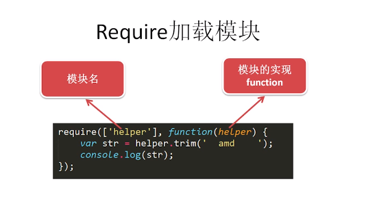
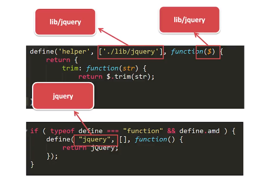
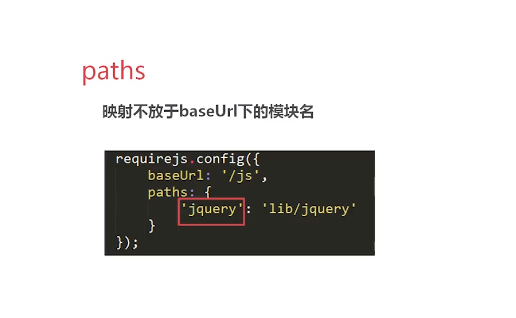
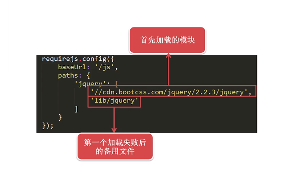
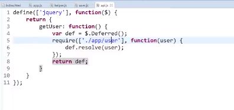

# RequireJs 基础

* [一、RequiredJs 简介](#RequireJs简介)
* [二、RequiredJs 方法](#RequireJs方法)  
* [三、baseUrl&data-main区别](#baseUrl&data-main区别) 
* [四、不在baseUrl的js文件](#不在baseUrl的js文件) 
* [五、举个例子](#举个例子) 
 ##### RequireJs简介

   * 异步加载文件，模块化开发：一个文件就是一个模块。
  
 ##### RequireJs方法
   * define:定义模块
   
      
      
      
      
   * require：加载模块 
   
      
   * RequireJs使用了head.appendChild()将每一个依赖加载为一个script标签。
   
 ##### baseUrl&data-main区别  
   * 原始写法
   
   
   * data-main写法
   
   
   * config方式
   
   
   
  ##### 不在baseUrl的js文件

   
 > 解决方案：baseUrl&paths的区别，映射不放在baseUrl的模块名。
   
  
 
  ##### 举个例子
 > 目录
 
   
  
 > 调用用户信息
 
   
  
   
   
   
    
 